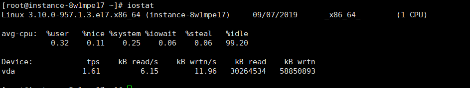
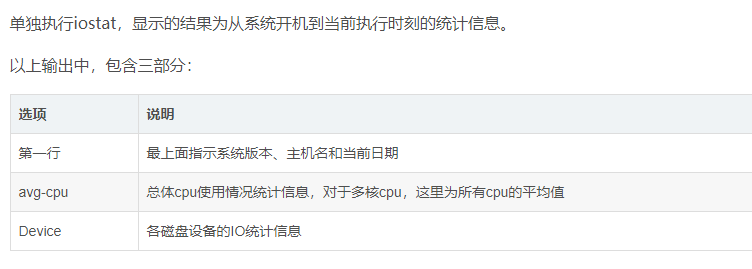
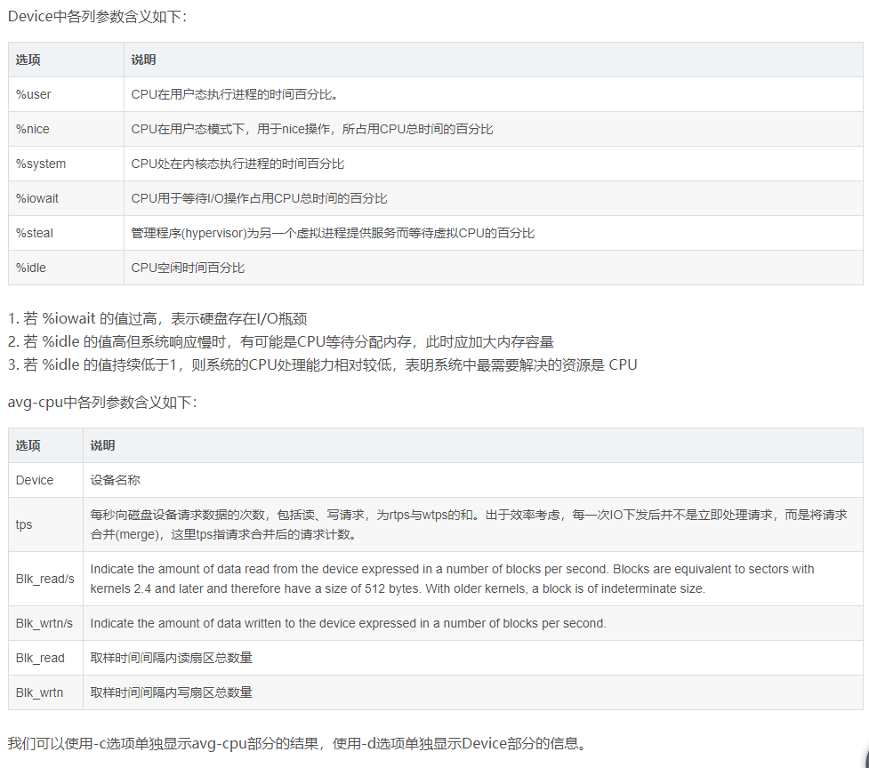
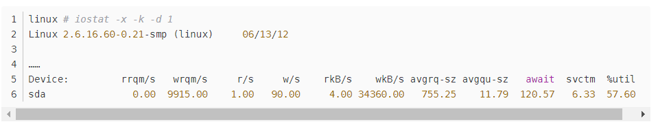
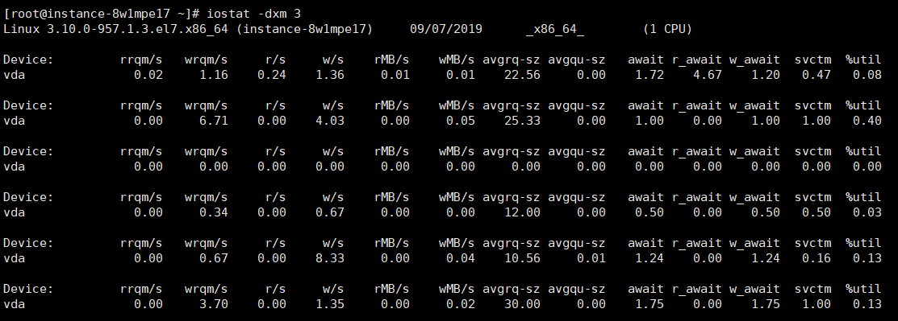

## 简介
```
iostat是I/O statistics（输入/输出统计）的缩写，
iostat工具将对系统的磁盘操作活动进行监视。它的特点
是汇报磁盘活动统计情况，
同时也会汇报出CPU使用情况。iostat也有一个弱点，
就是它不能对某个进程进行深入分析，仅对系统的整体情况进行分析
iostat 安装:
yum install sysstat

```




## 定时显示所有信息
```
# 【每隔2秒刷新显示，且显示3次】
iostat 2  3
```
## 显示指定磁盘信息
```
iostat -d /dev/sda
```
## 显示tty和Cpu信息
```
iostat -t
```

## 以M为单位显示所有信息
```
iostat -m
/*以kB为单位显示读写信息(-k选项)/以mB为单位显示读写信息(-m选项)*/
```

## 查看设备使用率（%util）、响应时间（await）
```
#  【-d 显示磁盘使用情况，-x 显示详细信息】
#  d: detail
iostat -d -x -k 1 1
```


```
对于以上示例输出，我们可以获取到以下信息： 
- 每秒向磁盘上写30M左右数据(wkB/s值) 
- 每秒有91次IO操作(r/s+w/s)，其中以写操作为主体 
- 平均每次IO请求等待时间为120.57毫秒，处理时间为6.33毫秒 
- 等待处理的IO请求队列中，平均有11.79个请求驻留

实际查看时，一般结合着多个选项查看: 如iostat -dxm 3
```

