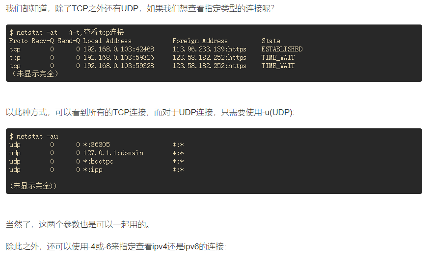
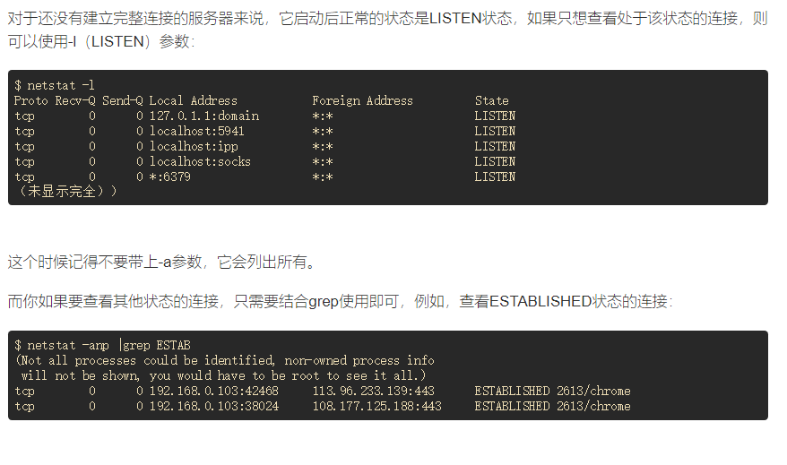
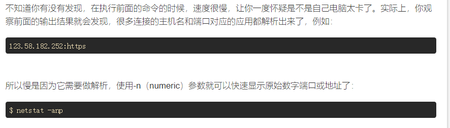
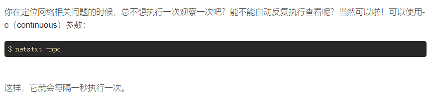
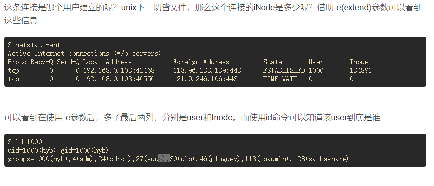
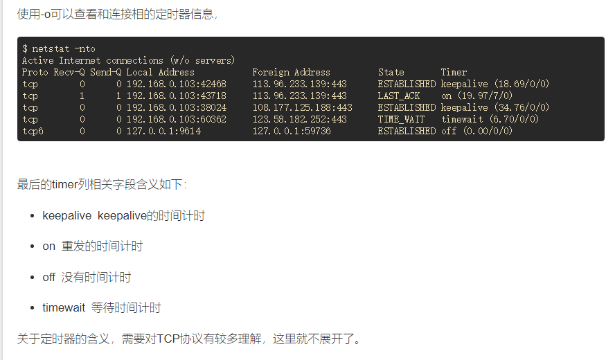
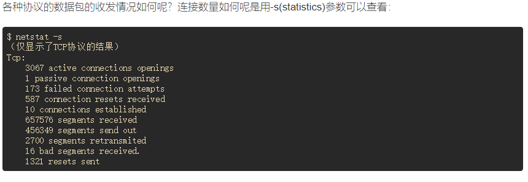
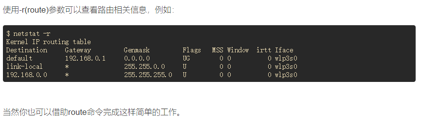

## 前言
```
在调试网络程序或者定位网络相关问题时，有一个命令不得不知，
它就是netstat。netstat命令用于查看网络连接，路由表，网络接口统计数据, 
虚拟连接等信息。netstat的选项很多，但是本文准备介绍一些netstat命令的实用技巧。
```

## 查看某个端口是否被占用
```
如果你遇到“Address already in use”的错误，
那么你就需要好好看看是不是端口已经被占用了。
-a（all）参数用于列出所有监听和非监听状态的连接。
```

```
这里我们可以看到，有一个tcp连接使用了6379端口，并且当前处于LISTEN状态，
这些状态信息对于分析网络连接问题非常有帮助，我们将会在后面的文章中看到它们大放异彩。
当然你也可以使用lsof命令中的方法来查看。
```

## 查找占用端口的进程
```
前面虽然知道已经有进程使用了6379端口，但是不知道是哪个进程，
因此为了知道进程信息，需要使用-p(program)参数：
```


```
这个时候就可以看到是进程id为10011的redis-server进程占用了6379端口，
至此要杀要剐就随你便了。
```

## 查看指定协议的连接


## 查看处于监听状态的连接


## 不解析主机，端口等信息


## 持续输出连接信息


## 查看用户和连接的iNode


## 查看连接相关的定时器


## 查看数据包统计信息


## 查看路由信息



