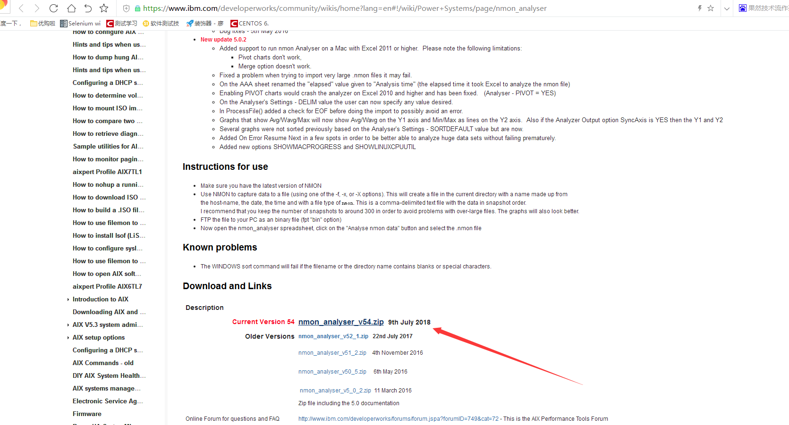
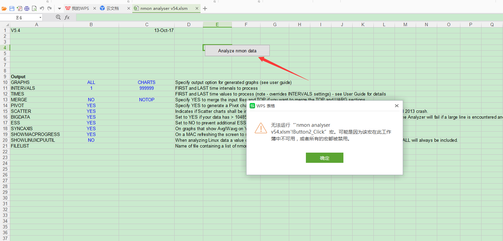
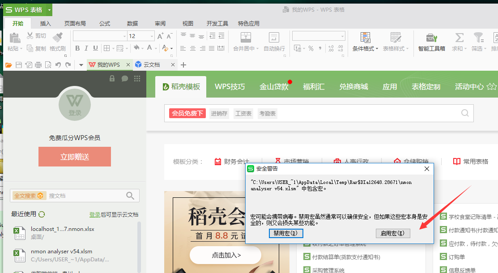
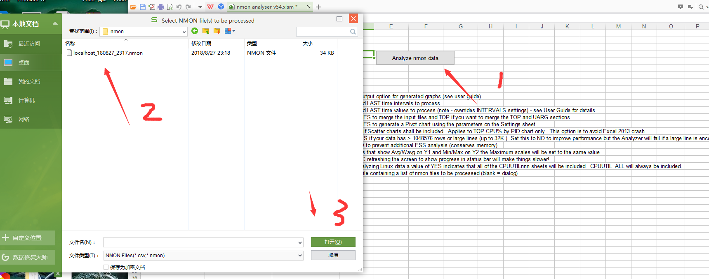
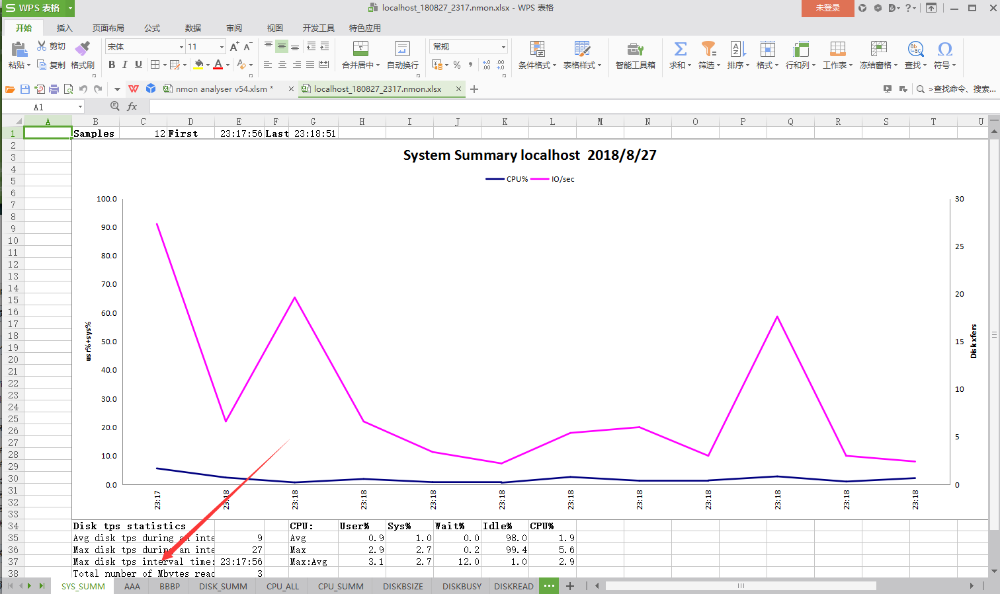
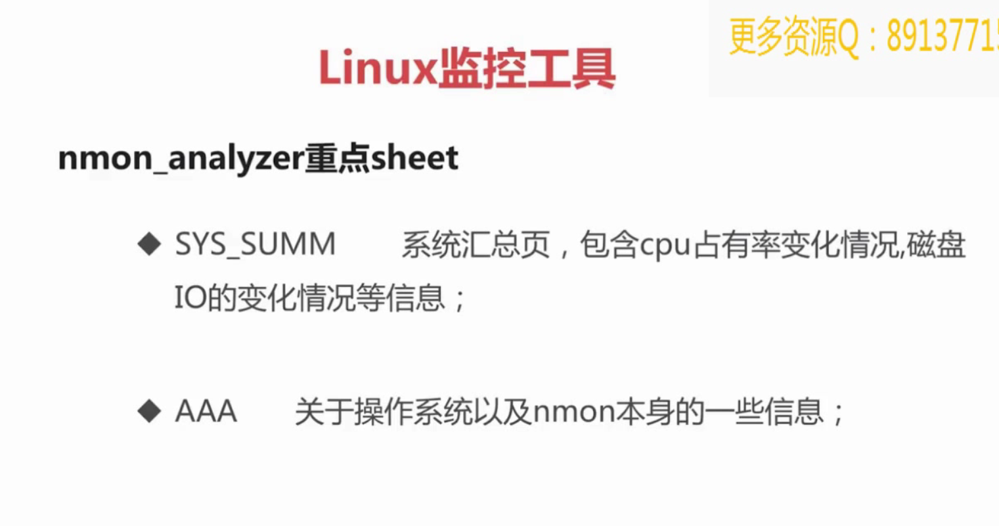
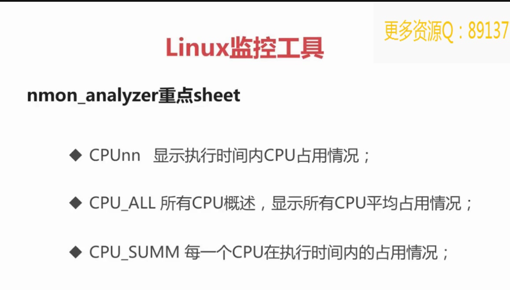
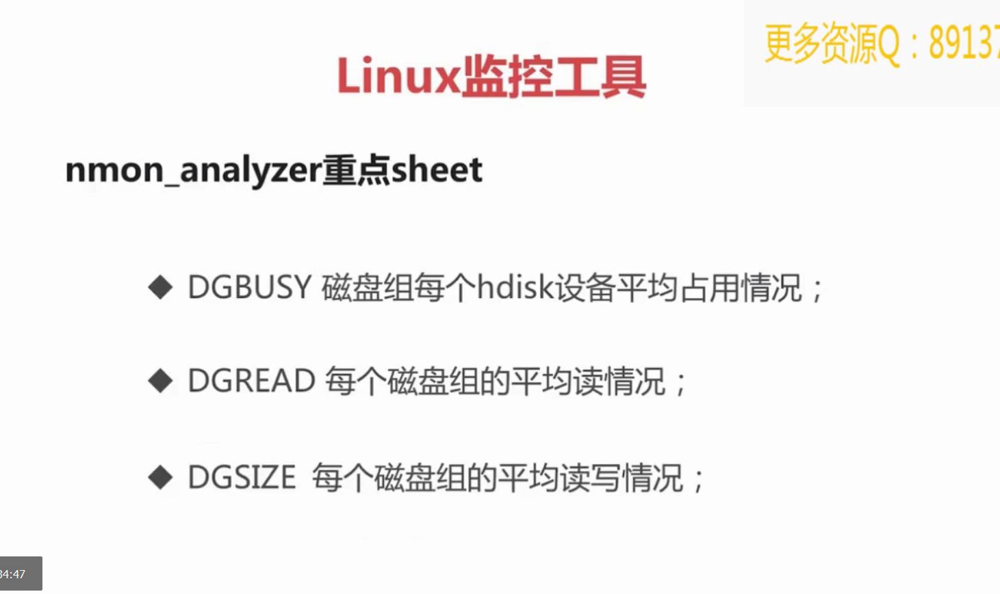
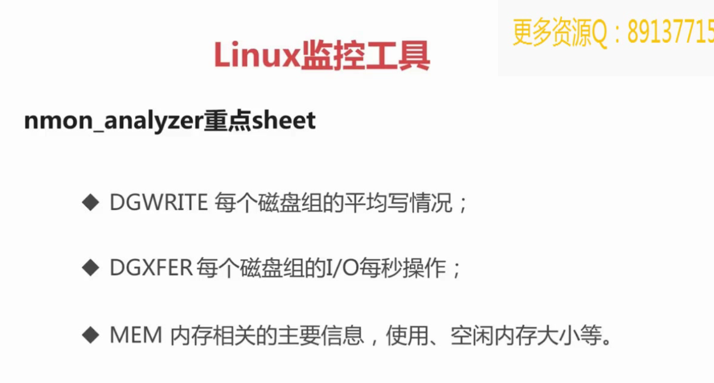
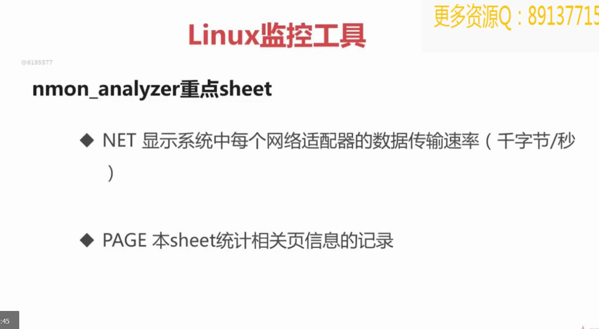

## 简介
Nmon是一款计算机性能系统监控工具

## 下载
### 首先查看Linux系统内核版本（两种方式）
```
1，cat /proc/version 
2，uname -a
```

### 接着下载nmon软件包
```
1，wget方式下载，地址：  https://nchc.dl.sourceforge.net/project/nmon/nmon16d_x86.tar.gz
2，官网手动下载，地址：http://nmon.sourceforge.net/pmwiki.php?n=Site.Downlo   自己看网上下载教程
```

### 解压安装
下载完成后，可以新建一个目录，作为解压后存放的目录
```
mkdir nmon16d
```
输入解压命令：tar -zxvf nmon16d_x86.tar.gz -C nmon16d ，-C 是指定解压目录
```
tar -zxvf nmon16d_x86.tar.gz  -C nmon16d
```
在nmon6d目录中，可以找到nmon_x86_64_centos6这个文件，并对它添加执行权限
```
chmod +x nmon_x86_64_centos6
```
再把该程序文件加入环境变量运行目录，如果不是管理员，需要加上sudo命令
```
mv nmon_x86_64_centos6 /usr/local/bin/nmon  一般这个命令就可以了

[qgc@localhost nmon16d]$ mv nmon_x86_64_centos6 /usr/local/bin/nmon
mv: cannot move `nmon_x86_64_centos6' to `/usr/local/bin/nmon': Permission denied
[qgc@localhost nmon16d]$ sudo mv nmon_x86_64_centos6 /usr/local/bin/nmon
[sudo] password for qgc: 
[qgc@localhost nmon16d]$ 
```

## 运行Nmon
输入nmon
```
q : 停止并退出 Nmon
h : 查看帮助
c : 查看 CPU 统计数据
m : 查看内存统计数据
d : 查看硬盘统计数据
k : 查看内核统计数据
n : 查看网络统计数据
N : 查看 NFS 统计数据
j : 查看文件系统统计数据
t : 查看高耗进程
V : 查看虚拟内存统计数据
v : 详细模式
```

## 数据采集
性能测试时，需要根据测试场景的执行情况，分析一段时间内系统资源的变化，这时需要nmon采集数据并保存下来，以下是常用的参数：
```
-f 参数:生成文件,文件名=主机名+当前时间.nmon  F是输出指定文件名称

-T 参数:显示资源占有率较高的进程

-s 参数:-s 10表示每隔10秒采集一次数据

-c 参数:-s 10表示总共采集十次数据

-m 参数:指定文件保存目录

具体的参数学习可参考博客：https://www.cnblogs.com/iclk/p/4456311.html
```
如每隔5秒采集一次，一共采集12次，就是1分钟的数据：
```
[qgc@localhost nmon16d]$ nmon -f -s 5 -c 12 -m /home/qgc/Desktop/
[qgc@localhost nmon16d]$ nmon -f -T -s 5 -c 12 -m /home/qgc/Desktop/
[qgc@localhost Desktop]$ ls
lmon16g.c                   localhost_180827_2318.nmon  nmon16d_x86.tar.gz
localhost_180827_2317.nmon  nmon16d                     Test
```
数据采集完毕后，如需关闭nmon进程，需要获取nmon的pid
```
[qgc@localhost Desktop]$ ps -ef | grep nmon
qgc        4455（pid）   4349（ppid）  0 23:40 pts/0    00:00:00 nmon
qgc        4491   4429  0 23:40 pts/1    00:00:00 grep nmon
```
再安全杀掉该进程：kill -9 pid
```
[qgc@localhost Desktop]$ kill -9 4455
[qgc@localhost Desktop]$ ps -ef | grep nmon
qgc        4493   4429  0 23:40 pts/1    00:00:00 grep nmon
```

## 数据分析
### 下载nmon analyser
```
借助nmon analyser可以把nmon采集的数据生成直观的Excel表，
nmon analyser可以在IBM的官网下载，
https://www.ibm.com/developerworks/community/wikis/home?lang=en#!/wiki/Power+Systems/page/nmon_analyser
```


在windows上下载后解压，有word和exce两个文档，Word是说明文档，
包括更新日志，详细参数等，其中的Excel就是nmon analyser工具了。

### 打开nmon analyser
双击打开nmon analyser v54.xlsm，点击Analyze nmon data按钮：

注：因为我用的个人免费版WPS（10.1），没有包含宏，需要安装宏插件(VBA for WPS)，
Excel是自带宏插件的，如果宏不能运行，需要做以下操作：
工具 -> 宏 -> 安全性 -> 中，然后再打开文件并允许运行宏。

### 下载VBA for WPS
下载VBA7.0.1590_For WPS(中文).exe后，先退出WPS，再直接安装就行，再次打开nmon analyser，启用宏


### 使用nmon analyser生成图表
成功打开nmon analyser后，点击Analyze nmon data按钮，选择nmon数据文件，会再次提示另存为，选择地址保存即可


###  下图就是nmon生成的数据报告截图，底部可以切换其他资源信息。



### 数据报告截图的底部的具体表示







