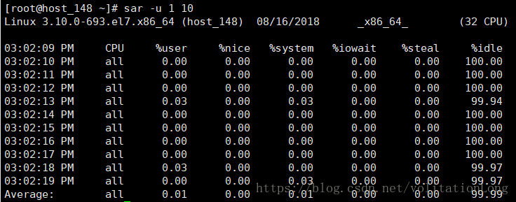
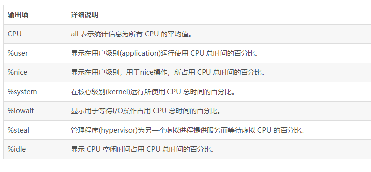
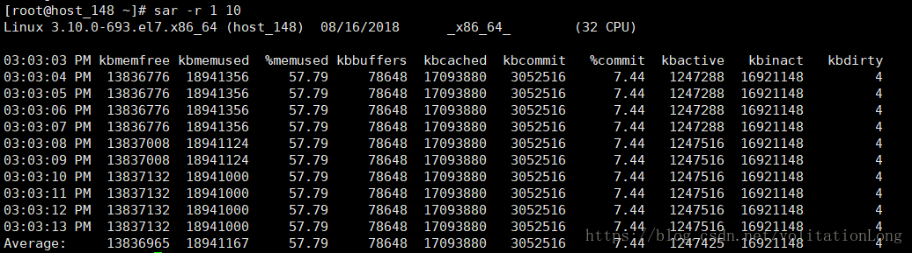
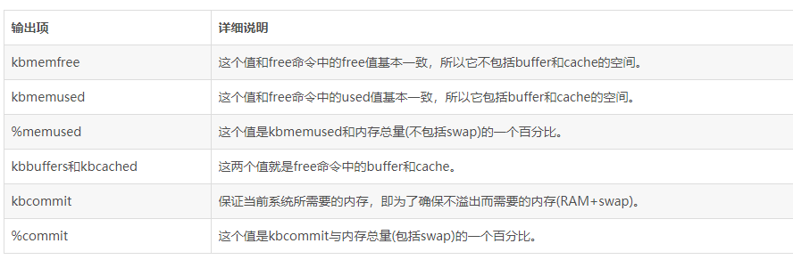
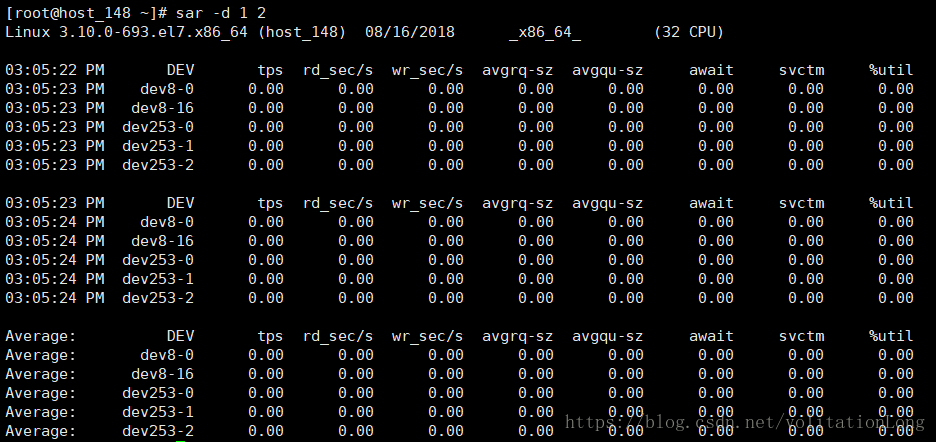
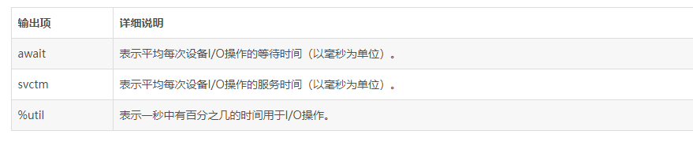
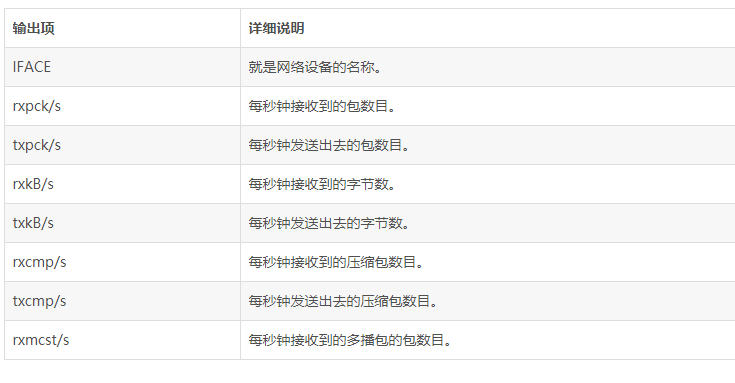

# 万能命令sar
## 1. CPU利用率
```
sar -p （查看全天）

sar -u 1 10 （1：每隔一秒，10：写入10次）
```

### 1.1. CPU输出项说明


## 2. 内存利用率
```
sar -r （查看全天）

sar -r 1 10 （1：每隔一秒，10：写入10次）
```

### 2.1. 内存输出项说明


## 3. 磁盘I/O
```
sar -d （查看全天）

sar -d 1 2 （1：每隔一秒，2：写入2次）
```


### 3.1. IO输出项说明


## 4. 网络流量
```
sar -n DEV （查看全天）

sar -n DEV 1 2 （1：每隔一秒，2：写入2次）
```


## 4.1. DEV输出项说明

