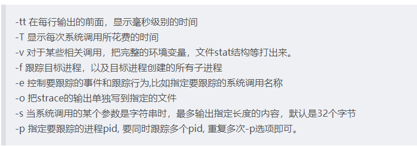
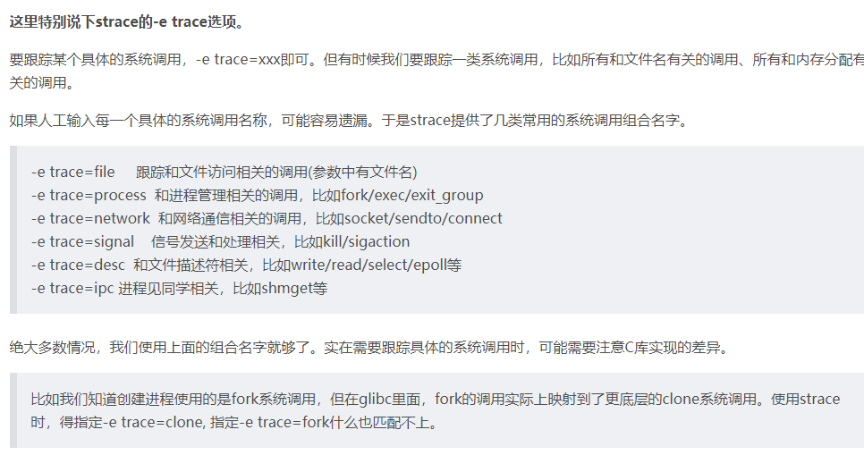

## 简介
```
strace命令是一个集诊断、调试、统计与一体的工具，
我们可以使用strace对应用的系统调用和信号传递的
跟踪结果来对应用进行分析
在命令执行的过程中，strace会记录和解析命令进程的
所有系统调用以及这个进程所接收到的所有的信号值。
```

## 用法
```
我们回到strace的使用上来。strace有两种运行模式。

一种是通过它启动要跟踪的进程。用法很简单，在原本的命令前加上strace即可。
比如我们要跟踪 "ls -lh /var/log/messages" 这个命令的执行，可以这样：

strace ls -lh /var/log/messages
另外一种运行模式，是跟踪已经在运行的进程，在不中断进程执行的情况下，理解它在干嘛。 
这种情况，给strace传递个-p pid 选项即可。

比如，有个在运行的some_server服务，第一步，查看pid:

pidof some_server                      
17553
得到其pid 17553然后就可以用strace跟踪其执行:

strace -p 17553
完成跟踪时，按ctrl + C 结束strace即可。

strace有一些选项可以调整其行为，我们这里介绍下其中几个比较常用的，然后通过示例讲解其实际应用效果。
```

## strace常用选项

从一个示例命令来看：
```
strace -tt -T -v -f -e trace=file -o /data/log/strace.log -s 1024 -p 23489
```

```
strace -tt -T -f -e trace=file -o /data/log/strace.log -s 1024 ./nginx
部分输出:

 

输出中，第一列显示的是进程的pid, 接着是毫秒级别的时间，这个是-tt 选项的效果。

每一行的最后一列，显示了该调用所花的时间，是-T选项的结果。

这里的输出只显示和文件访问有关的内容，这是因为我们通过-e trace=file 选项指定了。
```


```
-c 统计每一系统调用的所执行的时间,次数和出错的次数等.
-d 输出strace关于标准错误的调试信息.
-f 跟踪由fork调用所产生的子进程.
-ff 如果提供-o filename,则所有进程的跟踪结果输出到相应的filename.pid中,pid是各进程的进程号.
-F 尝试跟踪vfork调用.在-f时,vfork不被跟踪.
-h 输出简要的帮助信息.
-i 输出系统调用的入口指针.
-q 禁止输出关于脱离的消息.
-r 打印出相对时间关于,,每一个系统调用.
-t 在输出中的每一行前加上时间信息.
-tt 在输出中的每一行前加上时间信息,微秒级.
-ttt 微秒级输出,以秒了表示时间.
-T 显示每一调用所耗的时间.
-v 输出所有的系统调用.一些调用关于环境变量,状态,输入输出等调用由于使用频繁,默认不输出.
-V 输出strace的版本信息.
-x 以十六进制形式输出非标准字符串
-xx 所有字符串以十六进制形式输出.
-a column 设置返回值的输出位置.默认 为40.
-e [expr](http://man.linuxde.net/expr "expr命令") 
指定一个表达式,用来控制如何跟踪.格式：[qualifier=][!]value1[,value2]...
qualifier只能是 trace,abbrev,verbose,raw,signal,[read](http://man.linuxde.net/read "read命令")
,[write](http://man.linuxde.net/write "write命令")其中之一.
value是用来限定的符号或数字.默认的 qualifier是 trace.感叹号是否定符号.
例如:-eopen等价于 -e trace=open,表示只跟踪open调用.而-etrace!=open 
表示跟踪除了open以外的其他调用.有两个特殊的符号 all 和 none. 注意有些shell
使用!来执行历史记录里的命令,所以要使用\\.
-e trace=[set](http://man.linuxde.net/set "set命令") 只跟踪指定的系统 
调用.例如:-e trace=open,close,rean,write表示只跟踪这四个系统调用.默认的为set=all.
-e trace=[file](http://man.linuxde.net/file "file命令") 只跟踪有关文件操作的系统调用.
-e trace=process 只跟踪有关进程控制的系统调用.
-e trace=network 跟踪与网络有关的所有系统调用.
-e strace=signal 跟踪所有与系统信号有关的 系统调用
-e trace=ipc 跟踪所有与进程通讯有关的系统调用
-e abbrev=set 设定strace输出的系统调用的结果集.-v 等与 abbrev=none.默认为abbrev=all.
-e raw=set 将指定的系统调用的参数以十六进制显示.
-e signal=set 指定跟踪的系统信号.默认为all.如 signal=!SIGIO(或者signal=!io),表示不跟踪SIGIO信号.
-e read=set 输出从指定文件中读出 的数据.例如: -e read=3,5
-e write=set 输出写入到指定文件中的数据.
-o filename 将strace的输出写入文件filename
-p pid 跟踪指定的进程pid.
-s strsize 指定输出的字符串的最大长度.默认为32.文件名一直全部输出.
```
