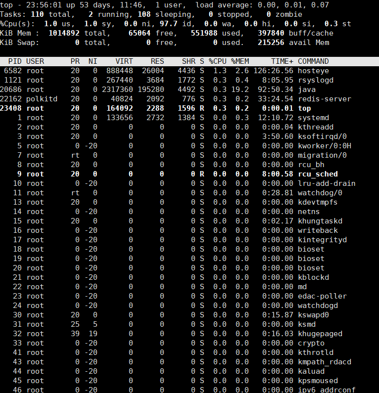

## 一.用途
　　显示linux进程信息

## 二.视图参数含义
```
top视图分为两部分：操作系统资源概况信息和进程信息。首先分析资源概况中各个参数的含义，再来分析下进程信息中各个参数含义。

资源概况
操作系统时间、登录用户、负载情况-top
10：33：25： 操作系统当前时间
up xx days, HH:MM： 操作系统从开机以后运行的时间，运行多少天多少时多少分
users： 当前系统有三个用户登录在线
load average: 1s, 5s, 15s系统平均负载
运行的任务概览-Tasks
total: 系统当前的进程数
running: 当前正在运行的进程数
sleeping 当前睡眠中的进程数
CPU概览： %Cpu(s) 表示CPU使用百分比，按照时间占用计算，单位s
us: 用户空间占用CPU时间百分比，如果是多核，这个数值表示占用的平均百分比，可以按1进行多核统计和平均统计切换
sy: 内核空间占用CPU时间百分比，如果是多核，同上
ni 用户进程空间内改变过优先级的进程占用CPU时间百分比
id: 空闲时间占用CPU百分比
wa: 等待输入输出的CPU时间百分比
hi: CPU服务于硬件中断的CPU时间百分比
si: CPU服务于软件中断的CPU时间百分比
注：时间占用百分比=该种类型操作消耗CPU时间/top刷新间隔时间。top 3s刷新一次，用户空间进程在这3s内使用了CPU 1.5s，那么us等于50%=1.5s/3s
内存概览：单位KiB
total： 内存总量
free： 剩余的内存数量
used: 内存使用数量
buff/cache: 用于缓冲的内存数量
交换区概览：单位KiB
total: 交换区总量
free: 空闲的交换区数量
used: 使用的交换区数量
```