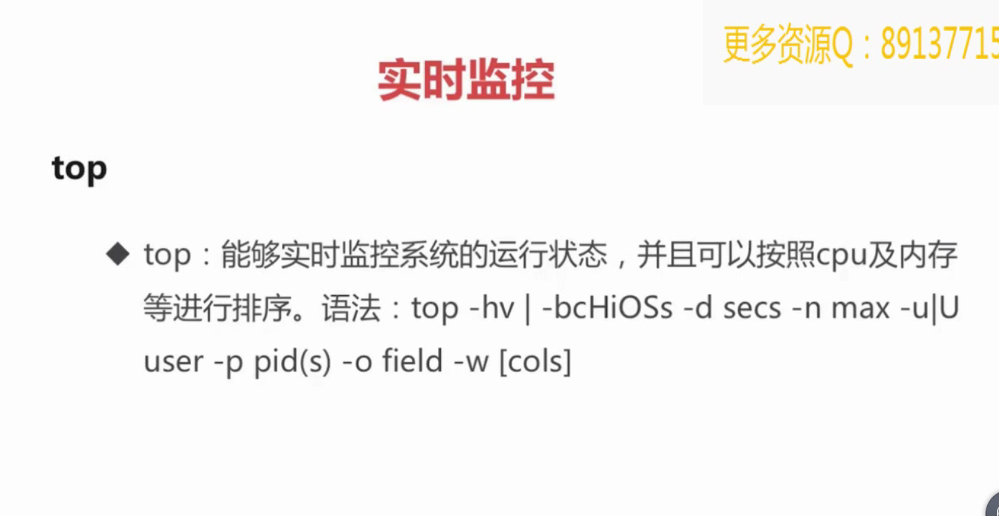

## 一.用途
　　显示linux进程信息

## 二.视图参数含义
```
top视图分为两部分：操作系统资源概况信息和进程信息。首先分析资源概况中各个参数的含义，再来分析下进程信息中各个参数含义。

资源概况
操作系统时间、登录用户、负载情况-top
10：33：25： 操作系统当前时间
up xx days, HH:MM： 操作系统从开机以后运行的时间，运行多少天多少时多少分
users： 当前系统有三个用户登录在线
load average: 1s, 5s, 15s系统平均负载
运行的任务概览-Tasks
total: 系统当前的进程数
running: 当前正在运行的进程数
sleeping 当前睡眠中的进程数
CPU概览： %Cpu(s) 表示CPU使用百分比，按照时间占用计算，单位s
us: 用户空间占用CPU时间百分比，如果是多核，这个数值表示占用的平均百分比，可以按1进行多核统计和平均统计切换
sy: 内核空间占用CPU时间百分比，如果是多核，同上
ni 用户进程空间内改变过优先级的进程占用CPU时间百分比
id: 空闲时间占用CPU百分比
wa: 等待输入输出的CPU时间百分比
hi: CPU服务于硬件中断的CPU时间百分比
si: CPU服务于软件中断的CPU时间百分比
注：时间占用百分比=该种类型操作消耗CPU时间/top刷新间隔时间。top 3s刷新一次，
	用户空间进程在这3s内使用了CPU 1.5s，那么us等于50%=1.5s/3s
内存概览：单位KiB
total： 内存总量
free： 剩余的内存数量
used: 内存使用数量
buff/cache: 用于缓冲的内存数量
交换区概览：单位KiB
total: 交换区总量
free: 空闲的交换区数量
used: 使用的交换区数量
进程概况
进程概况的统计从多维度参数进行展示的，其中最重要的参数：

PID 进程ID，唯一标识
USER 进程所属用户
%CPU 自上一次top刷新该进程占用CPU的时间百分比
%MEM 进程消耗内存百分比
TIME+ 自进程开始以来，消耗CPU时间，单位1/100秒
三.top中交互
交互命令：在执行top命令的视图中，执行特定命令与结果视图进行交互

全局
Enter/space： 刷新视图
h: 帮助信息，查询各个交互式命令的含义
0: 是否展示在进程区域中的0值，比如%CPU是0的将全部隐藏
A: 在全屏模式和多窗口选择模式之间切换
d: 设置刷新的时间间隔
E: 切换内存和交换区单位
H: 开启/关闭线程模式，以线程的方式展示
k: kill掉指定进程或者线程
Z: 改变颜色配置
q: 退出
概要区域
1: 显示CPU平均状态/分开显示各个逻辑CPU状态

m: 切换显示内存统计的数据

进程区域
x: 切换高亮行的排序位置
z: 切换颜色
b: 块状标记高亮行

c: 切换显示命令/程序名和参数
f: 显示field管理
u: 按照指定用户显示进程
i: 显示所有进程或者活跃的进程
n: 设置显示的进程数

四.top命令参数
-h | -v: 显示帮助或者版本信息】
** -c:** 命令行列显示程序名以及参数
-d: 启动时设置刷新时间间隔
-H： 设置线程模式
-i: 只显示活跃进程
-n: 显示指定数量的进程
-p: 显示指定PID的进程
-u: 显示指定用户的进程
```
