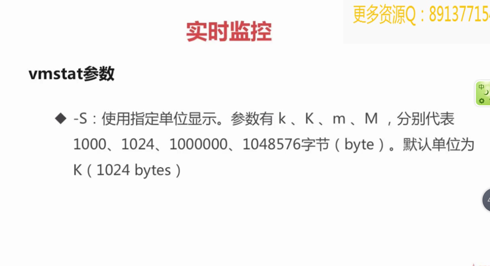
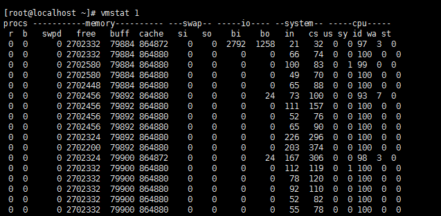
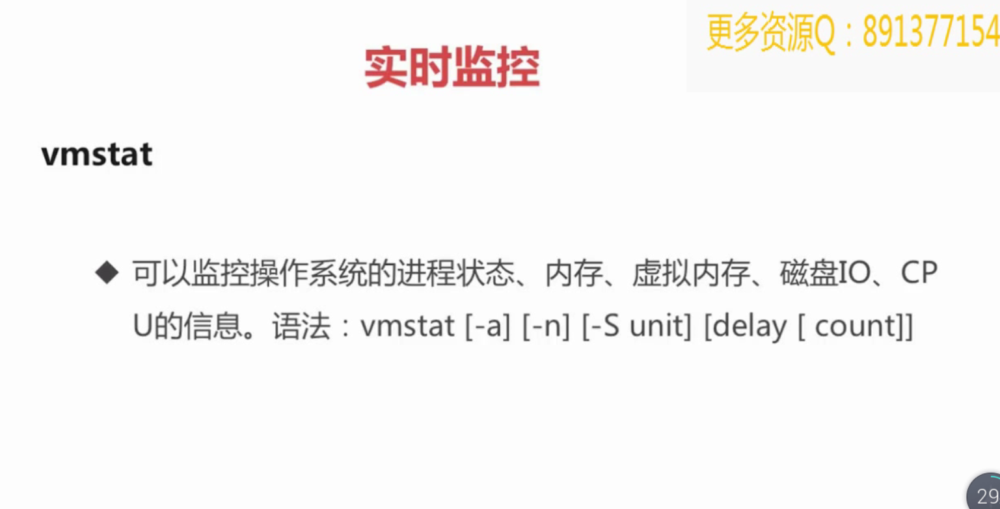

```
vmstat 1    1表示每秒采集一次
vmstat 2 1    2表示2秒采集一次，1表示只采集一次
r 表示运行队列(就是说多少个进程真的分配到CPU)
    我测试的服务器目前CPU比较空闲，没什么程序在跑，当这个值超过了CPU数目，
    就会出现CPU瓶颈了。这个也和top的负载有关系，一般负载超过了3就比较高，
    超过了5就高，超过了10就不正常了，服务器的状态很危险。top的负载类似每秒的运行队列。
    如果运行队列过大，表示你的CPU很繁忙，一般会造成CPU使用率很高。
b 表示阻塞的进程,这个不多说，进程阻塞，大家懂的。
swpd 虚拟内存已使用的大小
    如果大于0，表示你的机器物理内存不足了，如果不是程序内存泄露的原因，
    那么你该升级内存了或者把耗内存的任务迁移到其他机器。
free   空闲的物理内存的大小
buff 设备和设备之间的缓冲 
     Linux/Unix系统是用来存储，目录里面有什么内容，权限等的缓存
cache  cpu和内存之间的缓冲
    cache直接用来记忆我们打开的文件,给文件做缓冲，我本机大概占用300多M(
    	这里是Linux/Unix的聪明之处，把空闲的物理内存的一部分拿来做文件和目录的缓存，
    	是为了提高 程序执行的性能，当程序使用内存时，buffer/cached会很快地被使用。)
si  每秒从磁盘读入虚拟内存的大小，如果这个值大于0，表示物理内存不够用或者内存泄露了，
	要查找耗内存进程解决掉。我的机器内存充裕，一切正常。
so  每秒虚拟内存写入磁盘的大小，如果这个值大于0，同上。
bi  块设备每秒接收的块数量，这里的块设备是指系统上所有的磁盘和其他块设备，默认块大小是1024byte
    我本机上没什么IO操作，所以一直是0，但是我曾在处理拷贝
    大量数据(2-3T)的机器上看过可以达到140000/s，磁盘写入速度差不多140M每秒
bo 块设备每秒发送的块数量，例如我们读取文件，bo就要大于0。bi和bo一般都要接近0，不然就是IO过于频繁，需要调整。
in 每秒CPU的中断次数，包括时间中断
cs 每秒上下文切换次数
    例如我们调用系统函数，就要进行上下文切换，线程的切换，也要进程上下文切换，
    这个值要越小越好，太大了，要考虑调低线程或者进程的数目,例如在apache和nginx这种web服务器中
    ，我们一般做性能测试时会进行几千并发甚至几万并发的测试，选择web服务器的进程可以由进程或者线程
    的峰值一直下调，压测，直到cs到一个比较小的值，这个进程和线程数就是比较合适的值了。系统调用也是，
    每次调用系统函数，我们的代码就会进入内核空间，导致上下文切换，这个是很耗资源，也要尽量避免频繁
    调用系统函数。上下文切换次数过多表示你的CPU大部分浪费在上下文切换，导致CPU干正经事的时间少了，CPU没有充分利用，是不可取的。
us 用户CPU时间
    我曾经在一个做加密解密很频繁的服务器上，可以看到us接近100,r运行队列达到80(机器在做压力测试，性能表现不佳)。
sy 系统CPU时间，如果太高，表示系统调用时间长，例如是IO操作频繁。
id  空闲 CPU时间，一般来说，id + us + sy = 100,一般我认为id是空闲CPU使用率，us是用户CPU使用率，sy是系统CPU使用率。
wa 等待IO CPU时间。

重点参数    r,b,swpd,free,buff,cache,si,so,bi,bo

性能分析信息：

IO/CPU/men连锁反应
    1.free急剧下降
    2.buff和cache被回收下降，但也无济于事
    3.依旧需要使用大量swap交换分区swpd
    4.等待进程数，b增多
    5.读写IO，bi bo增多
    6.si so大于0开始从硬盘中读取
    7.cpu等待时间用于 IO等待，wa增加
内存不足
    1.开始使用swpd，swpd不为0
    2.si so大于0开始从硬盘中读取
io瓶颈：
    1.读写IO，bi bo增多超过2000
    2.cpu等待时间用于 IO等待，wa增加 超过20
    3.sy 系统调用时间长，IO操作频繁会导致增加 >30%
    4.wa io等待时间长
        iowait% <20%            良好
        iowait% <35%            一般
        iowait% >50%
    5.进一步使用iostat观察
CPU瓶颈：load,vmstat中r列
    1.反应为CPU队列长度
    2.一段时间内，CPU正在处理和等待CPU处理的进程数之和，直接反应了CPU的使用和申请情况。
    3.理想的load average：核数*CPU数*0.7
        CPU个数：grep 'physical id' /proc/cpuinfo | sort -u
        核数：grep 'core id' /proc/cpuinfo | sort -u | wc -l
    4.超过这个值就说明已经是CPU瓶颈了
CPU瓶颈
    1.us 用户CPU时间高超过90%
涉及到web服务器，cs 每秒上下文切换次数
    例如我们调用系统函数，就要进行上下文切换，线程的切换，也要进程上下文切换，
    这个值要越小越好，太大了，要考虑调低线程或者进程的数目,例如在apache和nginx
    这种web服务器中，我们一般做性能测试时会进行几千并发甚至几万并发的测试，
    选择web服务器的进程可以由进程或者线程的峰值一直下调，压测，直到cs到一个
    比较小的值，这个进程和线程数就是比较合适的值了。系统调用也是，每次调用
    系统函数，我们的代码就会进入内核空间，导致上下文切换，这个是很耗资源，
    也要尽量避免频繁调用系统函数。上下文切换次数过多表示你的CPU大部分浪费在
    上下文切换，导致CPU干正经事的时间少了，CPU没有充分利用，是不可取的。
    1.cs可以对apache和nginx线程和进程数限制起到一定的参考作用
    2.我们一般做性能测试时会进行几千并发甚至几万并发的测试，选择web服务器的
    进程可以由进程或者线程的峰值一直下调，压测，直到cs到一个比较小的值，这个
    进程和线程数就是比较合适的值了
较好的趋势：主要是 swap使用少，swpd数值低。si so分页读取写入数值趋近于零
```
